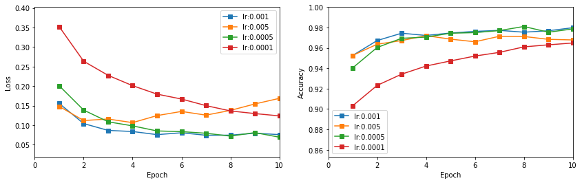
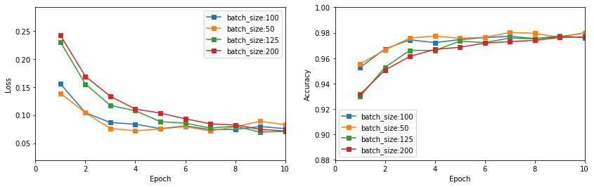
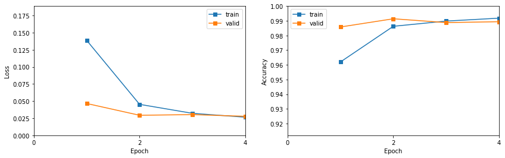
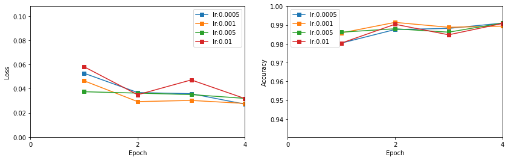
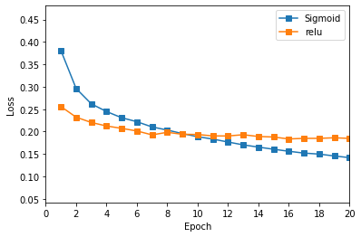

<h1>Table of Contents<span class="tocSkip"></span></h1>
<div class="toc"><ul class="toc-item"><li><span><a href="#导入工具包" data-toc-modified-id="导入工具包-1"><span class="toc-item-num">1&nbsp;&nbsp;</span>导入工具包</a></span></li><li><span><a href="#载入数据集" data-toc-modified-id="载入数据集-2"><span class="toc-item-num">2&nbsp;&nbsp;</span>载入数据集</a></span><ul class="toc-item"><li><span><a href="#MNIST数据集" data-toc-modified-id="MNIST数据集-2.1"><span class="toc-item-num">2.1&nbsp;&nbsp;</span>MNIST数据集</a></span></li><li><span><a href="#CIFAR-10数据集" data-toc-modified-id="CIFAR-10数据集-2.2"><span class="toc-item-num">2.2&nbsp;&nbsp;</span>CIFAR-10数据集</a></span></li></ul></li><li><span><a href="#模型搭建" data-toc-modified-id="模型搭建-3"><span class="toc-item-num">3&nbsp;&nbsp;</span>模型搭建</a></span><ul class="toc-item"><li><span><a href="#多层感知机" data-toc-modified-id="多层感知机-3.1"><span class="toc-item-num">3.1&nbsp;&nbsp;</span>多层感知机</a></span></li><li><span><a href="#卷积神经网络" data-toc-modified-id="卷积神经网络-3.2"><span class="toc-item-num">3.2&nbsp;&nbsp;</span>卷积神经网络</a></span></li><li><span><a href="#训练和测试函数" data-toc-modified-id="训练和测试函数-3.3"><span class="toc-item-num">3.3&nbsp;&nbsp;</span>训练和测试函数</a></span></li><li><span><a href="#图像绘制函数" data-toc-modified-id="图像绘制函数-3.4"><span class="toc-item-num">3.4&nbsp;&nbsp;</span>图像绘制函数</a></span></li></ul></li><li><span><a href="#基于MNIST数据集" data-toc-modified-id="基于MNIST数据集-4"><span class="toc-item-num">4&nbsp;&nbsp;</span>基于MNIST数据集</a></span><ul class="toc-item"><li><span><a href="#MLP" data-toc-modified-id="MLP-4.1"><span class="toc-item-num">4.1&nbsp;&nbsp;</span>MLP</a></span><ul class="toc-item"><li><span><a href="#训练" data-toc-modified-id="训练-4.1.1"><span class="toc-item-num">4.1.1&nbsp;&nbsp;</span>训练</a></span></li><li><span><a href="#调参对比" data-toc-modified-id="调参对比-4.1.2"><span class="toc-item-num">4.1.2&nbsp;&nbsp;</span>调参对比</a></span></li></ul></li><li><span><a href="#CNN" data-toc-modified-id="CNN-4.2"><span class="toc-item-num">4.2&nbsp;&nbsp;</span>CNN</a></span><ul class="toc-item"><li><span><a href="#训练" data-toc-modified-id="训练-4.2.1"><span class="toc-item-num">4.2.1&nbsp;&nbsp;</span>训练</a></span></li><li><span><a href="#调参对比" data-toc-modified-id="调参对比-4.2.2"><span class="toc-item-num">4.2.2&nbsp;&nbsp;</span>调参对比</a></span><ul class="toc-item"><li><span><a href="#学习率" data-toc-modified-id="学习率-4.2.2.1"><span class="toc-item-num">4.2.2.1&nbsp;&nbsp;</span>学习率</a></span></li><li><span><a href="#batch_size" data-toc-modified-id="batch_size-4.2.2.2"><span class="toc-item-num">4.2.2.2&nbsp;&nbsp;</span>batch_size</a></span></li><li><span><a href="#每层神经元个数" data-toc-modified-id="每层神经元个数-4.2.2.3"><span class="toc-item-num">4.2.2.3&nbsp;&nbsp;</span>每层神经元个数</a></span></li><li><span><a href="#神经元层数" data-toc-modified-id="神经元层数-4.2.2.4"><span class="toc-item-num">4.2.2.4&nbsp;&nbsp;</span>神经元层数</a></span></li></ul></li></ul></li><li><span><a href="#总结" data-toc-modified-id="总结-4.3"><span class="toc-item-num">4.3&nbsp;&nbsp;</span>总结</a></span></li></ul></li><li><span><a href="#基于CIFAR10数据集" data-toc-modified-id="基于CIFAR10数据集-5"><span class="toc-item-num">5&nbsp;&nbsp;</span>基于CIFAR10数据集</a></span><ul class="toc-item"><li><span><a href="#MLP" data-toc-modified-id="MLP-5.1"><span class="toc-item-num">5.1&nbsp;&nbsp;</span>MLP</a></span><ul class="toc-item"><li><span><a href="#训练" data-toc-modified-id="训练-5.1.1"><span class="toc-item-num">5.1.1&nbsp;&nbsp;</span>训练</a></span></li></ul></li><li><span><a href="#CNN" data-toc-modified-id="CNN-5.2"><span class="toc-item-num">5.2&nbsp;&nbsp;</span>CNN</a></span><ul class="toc-item"><li><span><a href="#训练" data-toc-modified-id="训练-5.2.1"><span class="toc-item-num">5.2.1&nbsp;&nbsp;</span>训练</a></span></li><li><span><a href="#调参" data-toc-modified-id="调参-5.2.2"><span class="toc-item-num">5.2.2&nbsp;&nbsp;</span>调参</a></span><ul class="toc-item"><li><span><a href="#kernel_size" data-toc-modified-id="kernel_size-5.2.2.1"><span class="toc-item-num">5.2.2.1&nbsp;&nbsp;</span>kernel_size</a></span></li><li><span><a href="#神经元层数" data-toc-modified-id="神经元层数-5.2.2.2"><span class="toc-item-num">5.2.2.2&nbsp;&nbsp;</span>神经元层数</a></span></li></ul></li><li><span><a href="#数据增强" data-toc-modified-id="数据增强-5.2.3"><span class="toc-item-num">5.2.3&nbsp;&nbsp;</span>数据增强</a></span></li></ul></li></ul></li></ul></div>

## 导入工具包


```python
import matplotlib.pyplot as plt
%matplotlib inline
import numpy as np
import torch
import torchvision
import torch.nn as nn
import torch.nn.functional as F
import torch.optim as optim
import warnings
warnings.filterwarnings('ignore')
import os
os.environ["CUDA_VISIBLE_DEVICES"] = "0"
os.environ['CUDA_LAUNCH_BLOCKING'] = '1'
torch.cuda.empty_cache()
from torch import unsqueeze as usq
from torchvision import datasets, transforms
from torch.utils.data import DataLoader, random_split
```


```python
random_seed = 20
torch.manual_seed(random_seed)
torch.cuda.manual_seed_all(random_seed)
torch.backends.cudnn.deterministic = True
torch.backends.cudnn.enabled = True
torch.backends.cudnn.benchmark = True
device = torch.device("cuda:0" if torch.cuda.is_available() else "cpu")
```

## 载入数据集

### MNIST数据集


```python
transform1 = transforms.Compose([transforms.ToTensor(),transforms.Normalize((0.1307,), (0.3081,))]) # normalise
train_data1 = datasets.MNIST(root='MNIST', train=True, transform=transform1, download=True)
test_data1 = datasets.MNIST(root='MNIST', train=False, transform=transform1, download=True)
train_split1, valid_split1 = random_split(train_data1, [55000, 5000])
```

### CIFAR-10数据集


```python
transform2 = transforms.Compose([transforms.ToTensor(), transforms.Normalize((0.5, 0.5, 0.5),(0.5, 0.5, 0.5))])
train_data2 = datasets.CIFAR10(root='CIFAR-10', train=True, transform=transform2, download=True)
test_data2 = datasets.CIFAR10(root='CIFAR-10', train=False, transform=transform2, download=True)
train_split2, valid_split2 = random_split(train_data2, [45000, 5000])
```

    Files already downloaded and verified
    Files already downloaded and verified


## 模型搭建

### 多层感知机


```python
class MLPmodel(nn.Module):
    def __init__(self, layer):
        super(MLPmodel, self).__init__()
        self.f_dict = nn.ModuleDict({'sigmoid': nn.Sigmoid(), 'relu': nn.ReLU(), 'tanh': nn.Tanh(), 'softmax': nn.Softmax(),
                                     'dropout': nn.Dropout(p=0.5)})
        self.model = nn.Sequential()
        for i in range(len(layer)):
            if type(layer[i]) == list:
                self.model.append(nn.Linear(layer[i][0], layer[i][1]))
            elif layer[i] == 'BN1':
                self.model.append(nn.BatchNorm1d(num_features=layer[i - 1][1]))
            elif layer[i] == 'BN2':
                self.model.append(nn.BatchNorm2d(num_features=layer[i - 1][1]))
            else:
                self.model.append(self.f_dict[layer[i]])

    def forward(self, x):
        output = self.model(x)
        return output
```

### 卷积神经网络


```python
class CNNmodel(nn.Module):
    def __init__(self, layer, kernel_size, stride, pool_size, padding):
        super(CNNmodel, self).__init__()
        self.f_dict = nn.ModuleDict({'sigmoid': nn.Sigmoid(), 'relu': nn.ReLU(), 'tanh': nn.Tanh(), 'softmax': nn.Softmax(),
                                     'dropout': nn.Dropout(p=0.5), 'pool': nn.MaxPool2d(kernel_size=pool_size)})
        self.layer1 = nn.Sequential()
        for i in range(len(layer)):
            if type(layer[i]) == list:
                if layer[i][2] == 'linear':
                    num = i
                    break
                elif layer[i][2] == 'conv':
                    self.layer1.append(nn.Conv2d(layer[i][0], layer[i][1], kernel_size=kernel_size, stride=stride, padding=padding))
            elif layer[i] == 'BN':
                self.layer1.append(nn.BatchNorm2d(layer[i - 1][1]))
            else:
                self.layer1.append(self.f_dict[layer[i]])
                
        self.layer2 = nn.Sequential()
        for i in range(num, len(layer)):
            if type(layer[i]) == list and layer[i][2] == 'linear':
                self.layer2.append(nn.Linear(layer[i][0], layer[i][1]))
            else:
                self.layer2.append(self.f_dict[layer[i]])

    def forward(self, x):
        output = self.layer1(x)
        output = torch.reshape(output,(x.size(0), -1))
        output = self.layer2(output)
        return output
```

### 训练和测试函数


```python
def train(max_epoch, batch_size, lr, dataset, model, criterion, optimizer, mode):
    train_split, valid_split, test_data = dataset
    model = model.to(device)
    optimizer = optimizer(params=model.parameters(),lr=lr)
    avg_train_loss, avg_train_acc = torch.tensor([], device=device), torch.tensor([], device=device)
    avg_valid_loss, avg_valid_acc = torch.tensor([], device=device), torch.tensor([], device=device)
    for epoch in range(max_epoch):
        train_load = DataLoader(dataset=train_split, batch_size=batch_size, shuffle=True, num_workers=4, pin_memory=True)
        valid_load = DataLoader(dataset=valid_split, batch_size=batch_size, shuffle=False, num_workers=4, pin_memory=True)
        batch_train_loss, batch_train_acc = torch.tensor([], device=device), torch.tensor([], device=device)
        for iters, (images, labels) in enumerate(train_load):
            optimizer.zero_grad()
            if mode == 'MLP':
                images = torch.reshape(images, (batch_size, -1)).to(device)
            elif mode == 'CNN':
                images = images.to(device)
            labels = labels.to(device)
            t = torch.zeros([batch_size, 10]).to(device)
            t[torch.arange(batch_size, dtype=torch.long), labels] = 1
            output = model.forward(images)
            idx = torch.argmax(output, axis=1)
            loss = criterion(output, labels)
            acc = torch.mean(t[torch.arange(output.shape[0], dtype=torch.long), idx].float())
            batch_train_loss = torch.cat([batch_train_loss, usq(loss, 0)], dim=0)
            batch_train_acc = torch.cat([batch_train_acc, usq(acc,0)], dim=0)
            loss.backward()
            optimizer.step()
        batch_valid_acc, batch_valid_loss = torch.tensor([], device=device), torch.tensor([], device=device)
        for images, labels in valid_load:
            with torch.no_grad():
                if mode == 'MLP':
                    images = torch.reshape(images, (batch_size, -1)).to(device)
                elif mode == 'CNN':
                    images = images.to(device)
                labels = labels.to(device)
                t = torch.zeros([batch_size, 10]).to(device)
                t[torch.arange(batch_size, dtype=torch.long), labels] = 1
                output = model.forward(images)
                idx = torch.argmax(output, axis=1)
                loss = criterion(output, labels)
                acc = torch.mean(t[torch.arange(output.shape[0], dtype=torch.long), idx].float())
                batch_valid_loss = torch.cat([batch_valid_loss, usq(loss, 0)], dim=0)
                batch_valid_acc = torch.cat([batch_valid_acc, usq(acc, 0)], dim=0)
        avg_train_acc = torch.cat([avg_train_acc, usq(torch.mean(batch_train_acc), 0)], dim=0)
        avg_train_loss = torch.cat([avg_train_loss, usq(torch.mean(batch_train_loss), 0)], dim=0)
        avg_valid_acc = torch.cat([avg_valid_acc, usq(torch.mean(batch_valid_acc), 0)], dim=0)
        avg_valid_loss = torch.cat([avg_valid_loss, usq(torch.mean(batch_valid_loss), 0)], dim=0)
        print('Epoch [{}]\t Average training loss {:.4f}\t Average training accuracy {:.4f}'.format(
            epoch, torch.mean(batch_train_loss).item(), torch.mean(batch_train_acc).item()))
        print('Epoch [{}]\t Average validation loss {:.4f}\t Average validation accuracy {:.4f}'.format(
            epoch, torch.mean(batch_valid_loss).item(), torch.mean(batch_valid_acc).item()), '\n')
    test_load = DataLoader(dataset=test_data, batch_size=batch_size, shuffle=False, num_workers=4, pin_memory=True)
    print('Testing...')
    batch_test_acc = torch.tensor([], device=device)
    for images, labels in test_load:
        with torch.no_grad():
            if mode == 'MLP':
                images = torch.reshape(images, (batch_size, -1)).to(device)
            elif mode == 'CNN':
                images = images.to(device)
            labels = labels.to(device)
            t = torch.zeros([batch_size, 10]).to(device)
            t[torch.arange(batch_size, dtype=torch.long), labels] = 1
            output = model.forward(images)
            idx = torch.argmax(output, axis=1)
            acc = torch.mean(t[torch.arange(output.shape[0], dtype=torch.long), idx].float())
            batch_test_acc = torch.cat([batch_test_acc, usq(acc, 0)], dim=0)
    print("The test accuracy is {:.4f}.\n".format(torch.mean(batch_test_acc).item()))
    avg_train_acc = avg_train_acc.cpu().detach().numpy()
    avg_train_loss = avg_train_loss.cpu().detach().numpy()
    avg_valid_acc = avg_valid_acc.cpu().detach().numpy()
    avg_valid_loss = avg_valid_loss.cpu().detach().numpy()
    return avg_train_loss, avg_train_acc, avg_valid_loss, avg_valid_acc
```

### 图像绘制函数


```python
def plot_loss_acc(loss_acc_dict, maxEpoch):
    max_loss = max([max(x[0]) for x in loss_acc_dict.values()]) + 0.05
    min_loss = max(0, min([min(x[0]) for x in loss_acc_dict.values()]) - 0.05)
    max_acc = min(1, max([max(x[1]) for x in loss_acc_dict.values()]) + 0.05)
    min_acc = max(0, min([min(x[1]) for x in loss_acc_dict.values()]) - 0.05)
    plt.figure(figsize=(14, 4))
    ax1 = plt.subplot(121); ax2 = plt.subplot(122)
    for key, value in loss_acc_dict.items():
        ax1.plot(range(1, 1 + maxEpoch), value[0], '-s', label=key)
        ax2.plot(range(1, 1 + maxEpoch), value[1], '-s', label=key)
    ax1.set_xlabel('Epoch')
    ax1.set_ylabel('Loss')
    ax1.set_xticks(range(0, maxEpoch + 1, 2))
    ax1.axis([0, maxEpoch, min_loss, max_loss])
    ax1.legend()
    ax2.set_xlabel('Epoch')
    ax2.set_ylabel('Accuracy')
    ax2.set_xticks(range(0, maxEpoch + 1, 2))
    ax2.axis([0, maxEpoch, min_acc, max_acc])
    plt.subplots_adjust(wspace=0.2)
    ax2.legend()
    plt.show()
```

## 基于MNIST数据集

MLP对MNIST的分析主要是基于一个隐含层的MLP模型

### MLP

#### 训练

以ReLU+Softmax交叉熵损失函数为例


```python
tloss1, tacc1, vloss1, vacc1 = train(max_epoch=10, batch_size=100, lr=0.001, dataset=[train_split1, valid_split1, test_data1],
                                     model=MLPmodel(layer=[[784, 128], 'relu', [128, 10]]), criterion=nn.CrossEntropyLoss(), 
                                     optimizer=optim.Adam, mode='MLP')
```

    Epoch [0]	 Average training loss 0.2992	 Average training accuracy 0.9128
    Epoch [0]	 Average validation loss 0.1556	 Average validation accuracy 0.9526 
    
    Epoch [1]	 Average training loss 0.1291	 Average training accuracy 0.9623
    Epoch [1]	 Average validation loss 0.1041	 Average validation accuracy 0.9672 
    
    Epoch [2]	 Average training loss 0.0899	 Average training accuracy 0.9734
    Epoch [2]	 Average validation loss 0.0866	 Average validation accuracy 0.9744 
    
    Epoch [3]	 Average training loss 0.0679	 Average training accuracy 0.9794
    Epoch [3]	 Average validation loss 0.0838	 Average validation accuracy 0.9722 
    
    Epoch [4]	 Average training loss 0.0550	 Average training accuracy 0.9836
    Epoch [4]	 Average validation loss 0.0758	 Average validation accuracy 0.9746 
    
    Epoch [5]	 Average training loss 0.0460	 Average training accuracy 0.9853
    Epoch [5]	 Average validation loss 0.0805	 Average validation accuracy 0.9762 
    
    Epoch [6]	 Average training loss 0.0367	 Average training accuracy 0.9885
    Epoch [6]	 Average validation loss 0.0742	 Average validation accuracy 0.9772 
    
    Epoch [7]	 Average training loss 0.0290	 Average training accuracy 0.9912
    Epoch [7]	 Average validation loss 0.0744	 Average validation accuracy 0.9754 
    
    Epoch [8]	 Average training loss 0.0245	 Average training accuracy 0.9924
    Epoch [8]	 Average validation loss 0.0795	 Average validation accuracy 0.9768 
    
    Epoch [9]	 Average training loss 0.0213	 Average training accuracy 0.9933
    Epoch [9]	 Average validation loss 0.0757	 Average validation accuracy 0.9798 
    
    Testing...
    The test accuracy is 0.9766.


​    


```python
plot_loss_acc({'train': [tloss1, tacc1], 'valid': [vloss1, vacc1]}, maxEpoch=10)
```


​    

​    


- 随着训练集上的损失降低准确率升高，验证集和训练集逐渐拉开了差距，甚至验证集上表现变差，表明有过拟合风险
- 不同的**随机种子**得到的验证集不同，数据表现亦不同

#### 调参对比

- 通过验证集调参对上述模型进行优化（MLP模型超参包括学习率，batch_size，迭代次数等）
- 调参顺序为：学习率==>batch_size==>max_epoch


```python
_, _, vloss11, vacc11 = train(max_epoch=10, batch_size=100, lr=0.005, dataset=[train_split1, valid_split1, test_data1],
                              model=MLPmodel(layer=[[784, 128], 'relu', [128, 10]]), criterion=nn.CrossEntropyLoss(), 
                              optimizer=optim.Adam, mode='MLP')
```

    Epoch [0]	 Average training loss 0.2346	 Average training accuracy 0.9274
    Epoch [0]	 Average validation loss 0.1481	 Average validation accuracy 0.9526 
    
    Epoch [1]	 Average training loss 0.1232	 Average training accuracy 0.9630
    Epoch [1]	 Average validation loss 0.1118	 Average validation accuracy 0.9636 
    
    Epoch [2]	 Average training loss 0.0990	 Average training accuracy 0.9691
    Epoch [2]	 Average validation loss 0.1157	 Average validation accuracy 0.9672 
    
    Epoch [3]	 Average training loss 0.0889	 Average training accuracy 0.9738
    Epoch [3]	 Average validation loss 0.1065	 Average validation accuracy 0.9720 
    
    Epoch [4]	 Average training loss 0.0786	 Average training accuracy 0.9767
    Epoch [4]	 Average validation loss 0.1245	 Average validation accuracy 0.9686 
    
    Epoch [5]	 Average training loss 0.0737	 Average training accuracy 0.9778
    Epoch [5]	 Average validation loss 0.1352	 Average validation accuracy 0.9660 
    
    Epoch [6]	 Average training loss 0.0703	 Average training accuracy 0.9800
    Epoch [6]	 Average validation loss 0.1257	 Average validation accuracy 0.9714 
    
    Epoch [7]	 Average training loss 0.0636	 Average training accuracy 0.9813
    Epoch [7]	 Average validation loss 0.1378	 Average validation accuracy 0.9712 
    
    Epoch [8]	 Average training loss 0.0699	 Average training accuracy 0.9805
    Epoch [8]	 Average validation loss 0.1543	 Average validation accuracy 0.9684 
    
    Epoch [9]	 Average training loss 0.0579	 Average training accuracy 0.9831
    Epoch [9]	 Average validation loss 0.1686	 Average validation accuracy 0.9678 
    
    Testing...
    The test accuracy is 0.9697.


​    


```python
_, _, vloss12, vacc12 = train(max_epoch=10, batch_size=100, lr=0.0005, dataset=[train_split1, valid_split1, test_data1],
                              model=MLPmodel(layer=[[784, 128], 'relu', [128, 10]]), criterion=nn.CrossEntropyLoss(), 
                              optimizer=optim.Adam, mode='MLP')
```

    Epoch [0]	 Average training loss 0.3733	 Average training accuracy 0.8967
    Epoch [0]	 Average validation loss 0.2009	 Average validation accuracy 0.9404 
    
    Epoch [1]	 Average training loss 0.1780	 Average training accuracy 0.9487
    Epoch [1]	 Average validation loss 0.1386	 Average validation accuracy 0.9604 
    
    Epoch [2]	 Average training loss 0.1251	 Average training accuracy 0.9639
    Epoch [2]	 Average validation loss 0.1087	 Average validation accuracy 0.9694 
    
    Epoch [3]	 Average training loss 0.0969	 Average training accuracy 0.9718
    Epoch [3]	 Average validation loss 0.0982	 Average validation accuracy 0.9706 
    
    Epoch [4]	 Average training loss 0.0769	 Average training accuracy 0.9775
    Epoch [4]	 Average validation loss 0.0852	 Average validation accuracy 0.9744 
    
    Epoch [5]	 Average training loss 0.0632	 Average training accuracy 0.9819
    Epoch [5]	 Average validation loss 0.0835	 Average validation accuracy 0.9750 
    
    Epoch [6]	 Average training loss 0.0533	 Average training accuracy 0.9845
    Epoch [6]	 Average validation loss 0.0793	 Average validation accuracy 0.9770 
    
    Epoch [7]	 Average training loss 0.0448	 Average training accuracy 0.9867
    Epoch [7]	 Average validation loss 0.0720	 Average validation accuracy 0.9810 
    
    Epoch [8]	 Average training loss 0.0377	 Average training accuracy 0.9892
    Epoch [8]	 Average validation loss 0.0810	 Average validation accuracy 0.9754 
    
    Epoch [9]	 Average training loss 0.0323	 Average training accuracy 0.9906
    Epoch [9]	 Average validation loss 0.0692	 Average validation accuracy 0.9786 
    
    Testing...
    The test accuracy is 0.9780.


​    


```python
_, _, vloss13, vacc13 = train(max_epoch=10, batch_size=100, lr=0.0001, dataset=[train_split1, valid_split1, test_data1],
                              model=MLPmodel(layer=[[784, 128], 'relu', [128, 10]]), criterion=nn.CrossEntropyLoss(), 
                              optimizer=optim.Adam, mode='MLP')
```

    Epoch [0]	 Average training loss 0.7145	 Average training accuracy 0.8282
    Epoch [0]	 Average validation loss 0.3522	 Average validation accuracy 0.9032 
    
    Epoch [1]	 Average training loss 0.3215	 Average training accuracy 0.9103
    Epoch [1]	 Average validation loss 0.2637	 Average validation accuracy 0.9232 
    
    Epoch [2]	 Average training loss 0.2636	 Average training accuracy 0.9256
    Epoch [2]	 Average validation loss 0.2276	 Average validation accuracy 0.9342 
    
    Epoch [3]	 Average training loss 0.2279	 Average training accuracy 0.9352
    Epoch [3]	 Average validation loss 0.2012	 Average validation accuracy 0.9422 
    
    Epoch [4]	 Average training loss 0.2010	 Average training accuracy 0.9431
    Epoch [4]	 Average validation loss 0.1795	 Average validation accuracy 0.9472 
    
    Epoch [5]	 Average training loss 0.1793	 Average training accuracy 0.9491
    Epoch [5]	 Average validation loss 0.1669	 Average validation accuracy 0.9520 
    
    Epoch [6]	 Average training loss 0.1622	 Average training accuracy 0.9542
    Epoch [6]	 Average validation loss 0.1501	 Average validation accuracy 0.9556 
    
    Epoch [7]	 Average training loss 0.1472	 Average training accuracy 0.9585
    Epoch [7]	 Average validation loss 0.1365	 Average validation accuracy 0.9610 
    
    Epoch [8]	 Average training loss 0.1353	 Average training accuracy 0.9616
    Epoch [8]	 Average validation loss 0.1297	 Average validation accuracy 0.9630 
    
    Epoch [9]	 Average training loss 0.1245	 Average training accuracy 0.9653
    Epoch [9]	 Average validation loss 0.1238	 Average validation accuracy 0.9648 
    
    Testing...
    The test accuracy is 0.9623.


​    


```python
_, _, vloss14, vacc14 = train(max_epoch=10, batch_size=100, lr=0.0007, dataset=[train_split1, valid_split1, test_data1],
                              model=MLPmodel(layer=[[784, 128], 'relu', [128, 10]]), criterion=nn.CrossEntropyLoss(), 
                              optimizer=optim.Adam, mode='MLP')
```

    Epoch [0]	 Average training loss 0.3280	 Average training accuracy 0.9065
    Epoch [0]	 Average validation loss 0.1692	 Average validation accuracy 0.9498 
    
    Epoch [1]	 Average training loss 0.1521	 Average training accuracy 0.9557
    Epoch [1]	 Average validation loss 0.1182	 Average validation accuracy 0.9640 
    
    Epoch [2]	 Average training loss 0.1050	 Average training accuracy 0.9696
    Epoch [2]	 Average validation loss 0.0966	 Average validation accuracy 0.9728 
    
    Epoch [3]	 Average training loss 0.0795	 Average training accuracy 0.9767
    Epoch [3]	 Average validation loss 0.0842	 Average validation accuracy 0.9760 
    
    Epoch [4]	 Average training loss 0.0627	 Average training accuracy 0.9811
    Epoch [4]	 Average validation loss 0.0783	 Average validation accuracy 0.9760 
    
    Epoch [5]	 Average training loss 0.0505	 Average training accuracy 0.9846
    Epoch [5]	 Average validation loss 0.0727	 Average validation accuracy 0.9758 
    
    Epoch [6]	 Average training loss 0.0419	 Average training accuracy 0.9874
    Epoch [6]	 Average validation loss 0.0690	 Average validation accuracy 0.9780 
    
    Epoch [7]	 Average training loss 0.0335	 Average training accuracy 0.9901
    Epoch [7]	 Average validation loss 0.0754	 Average validation accuracy 0.9762 
    
    Epoch [8]	 Average training loss 0.0286	 Average training accuracy 0.9918
    Epoch [8]	 Average validation loss 0.0691	 Average validation accuracy 0.9786 
    
    Epoch [9]	 Average training loss 0.0230	 Average training accuracy 0.9932
    Epoch [9]	 Average validation loss 0.0756	 Average validation accuracy 0.9770 
    
    Testing...
    The test accuracy is 0.9767.


​    


```python
plot_loss_acc({'lr:0.001': [vloss1, vacc1],'lr:0.005': [vloss11, vacc11],'lr:0.0005': [vloss12, vacc12],
              'lr:0.0001': [vloss13, vacc13]}, maxEpoch=10)
```


​    

​    


在学习率lr=0.001的基础上继而调整batch_size和max_epoch


```python
_, _, vloss15, vacc15 = train(max_epoch=10, batch_size=50, lr=0.001, dataset=[train_split1, valid_split1, test_data1],
                              model=MLPmodel(layer=[[784, 128], 'relu', [128, 10]]), criterion=nn.CrossEntropyLoss(), 
                              optimizer=optim.Adam, mode='MLP')
```

    Epoch [0]	 Average training loss 0.2586	 Average training accuracy 0.9233
    Epoch [0]	 Average validation loss 0.1387	 Average validation accuracy 0.9556 
    
    Epoch [1]	 Average training loss 0.1118	 Average training accuracy 0.9665
    Epoch [1]	 Average validation loss 0.1039	 Average validation accuracy 0.9664 
    
    Epoch [2]	 Average training loss 0.0769	 Average training accuracy 0.9764
    Epoch [2]	 Average validation loss 0.0762	 Average validation accuracy 0.9758 
    
    Epoch [3]	 Average training loss 0.0592	 Average training accuracy 0.9815
    Epoch [3]	 Average validation loss 0.0718	 Average validation accuracy 0.9774 
    
    Epoch [4]	 Average training loss 0.0457	 Average training accuracy 0.9857
    Epoch [4]	 Average validation loss 0.0752	 Average validation accuracy 0.9756 
    
    Epoch [5]	 Average training loss 0.0392	 Average training accuracy 0.9874
    Epoch [5]	 Average validation loss 0.0795	 Average validation accuracy 0.9764 
    
    Epoch [6]	 Average training loss 0.0316	 Average training accuracy 0.9894
    Epoch [6]	 Average validation loss 0.0716	 Average validation accuracy 0.9802 
    
    Epoch [7]	 Average training loss 0.0263	 Average training accuracy 0.9911
    Epoch [7]	 Average validation loss 0.0790	 Average validation accuracy 0.9796 
    
    Epoch [8]	 Average training loss 0.0229	 Average training accuracy 0.9923
    Epoch [8]	 Average validation loss 0.0889	 Average validation accuracy 0.9764 
    
    Epoch [9]	 Average training loss 0.0188	 Average training accuracy 0.9939
    Epoch [9]	 Average validation loss 0.0827	 Average validation accuracy 0.9800 
    
    Testing...
    The test accuracy is 0.9766.


​    


```python
_, _, vloss16, vacc16 = train(max_epoch=10, batch_size=125, lr=0.0005,dataset=[train_split1, valid_split1, test_data1],
                              model=MLPmodel(layer=[[784, 128], 'relu', [128, 10]]), criterion=nn.CrossEntropyLoss(), 
                              optimizer=optim.Adam, mode='MLP')
```

    Epoch [0]	 Average training loss 0.3964	 Average training accuracy 0.8909
    Epoch [0]	 Average validation loss 0.2299	 Average validation accuracy 0.9298 
    
    Epoch [1]	 Average training loss 0.1915	 Average training accuracy 0.9446
    Epoch [1]	 Average validation loss 0.1552	 Average validation accuracy 0.9528 
    
    Epoch [2]	 Average training loss 0.1385	 Average training accuracy 0.9598
    Epoch [2]	 Average validation loss 0.1171	 Average validation accuracy 0.9662 
    
    Epoch [3]	 Average training loss 0.1072	 Average training accuracy 0.9692
    Epoch [3]	 Average validation loss 0.1077	 Average validation accuracy 0.9660 
    
    Epoch [4]	 Average training loss 0.0873	 Average training accuracy 0.9752
    Epoch [4]	 Average validation loss 0.0881	 Average validation accuracy 0.9734 
    
    Epoch [5]	 Average training loss 0.0725	 Average training accuracy 0.9791
    Epoch [5]	 Average validation loss 0.0856	 Average validation accuracy 0.9722 
    
    Epoch [6]	 Average training loss 0.0615	 Average training accuracy 0.9826
    Epoch [6]	 Average validation loss 0.0768	 Average validation accuracy 0.9758 
    
    Epoch [7]	 Average training loss 0.0513	 Average training accuracy 0.9853
    Epoch [7]	 Average validation loss 0.0801	 Average validation accuracy 0.9752 
    
    Epoch [8]	 Average training loss 0.0434	 Average training accuracy 0.9877
    Epoch [8]	 Average validation loss 0.0696	 Average validation accuracy 0.9776 
    
    Epoch [9]	 Average training loss 0.0384	 Average training accuracy 0.9892
    Epoch [9]	 Average validation loss 0.0708	 Average validation accuracy 0.9760 
    
    Testing...
    The test accuracy is 0.9789.


​    


```python
_, _, vloss17, vacc17 = train(max_epoch=10, batch_size=200, lr=0.0005, dataset=[train_split1, valid_split1, test_data1],
                              model=MLPmodel(layer=[[784, 128], 'relu', [128, 10]]), criterion=nn.CrossEntropyLoss(), 
                              optimizer=optim.Adam, mode='MLP')
```

    Epoch [0]	 Average training loss 0.4528	 Average training accuracy 0.8786
    Epoch [0]	 Average validation loss 0.2419	 Average validation accuracy 0.9314 
    
    Epoch [1]	 Average training loss 0.2106	 Average training accuracy 0.9398
    Epoch [1]	 Average validation loss 0.1689	 Average validation accuracy 0.9506 
    
    Epoch [2]	 Average training loss 0.1551	 Average training accuracy 0.9565
    Epoch [2]	 Average validation loss 0.1333	 Average validation accuracy 0.9614 
    
    Epoch [3]	 Average training loss 0.1241	 Average training accuracy 0.9651
    Epoch [3]	 Average validation loss 0.1107	 Average validation accuracy 0.9668 
    
    Epoch [4]	 Average training loss 0.1020	 Average training accuracy 0.9714
    Epoch [4]	 Average validation loss 0.1034	 Average validation accuracy 0.9686 
    
    Epoch [5]	 Average training loss 0.0864	 Average training accuracy 0.9758
    Epoch [5]	 Average validation loss 0.0933	 Average validation accuracy 0.9718 
    
    Epoch [6]	 Average training loss 0.0741	 Average training accuracy 0.9793
    Epoch [6]	 Average validation loss 0.0844	 Average validation accuracy 0.9730 
    
    Epoch [7]	 Average training loss 0.0646	 Average training accuracy 0.9817
    Epoch [7]	 Average validation loss 0.0823	 Average validation accuracy 0.9740 
    
    Epoch [8]	 Average training loss 0.0566	 Average training accuracy 0.9844
    Epoch [8]	 Average validation loss 0.0745	 Average validation accuracy 0.9762 
    
    Epoch [9]	 Average training loss 0.0497	 Average training accuracy 0.9865
    Epoch [9]	 Average validation loss 0.0715	 Average validation accuracy 0.9768 
    
    Testing...
    The test accuracy is 0.9756.


​    


```python
plot_loss_acc({'batch_size:100': [vloss1, vacc1],'batch_size:50': [vloss15, vacc15],'batch_size:125': [vloss16, vacc16],
              'batch_size:200': [vloss17, vacc17]}, maxEpoch=10)
```


​    

​    


### CNN

#### 训练


```python
tloss2, tacc2, vloss2, vacc2 = train(max_epoch=4, batch_size=100, lr=0.001, dataset=[train_split1, valid_split1, test_data1],
                                     model=CNNmodel(layer=[[1, 8, 'conv'], 'BN', 'relu','pool', [8, 16, 'conv'], 'BN', 'relu','pool', 
                                                           [16, 32, 'conv'],'BN', 'relu',[1568, 10, 'linear']], kernel_size=5, stride=1, 
                                                    pool_size=2, padding=2), criterion=nn.CrossEntropyLoss(), optimizer=optim.Adam, 
                                     mode='CNN')
```

    Epoch [0]	 Average training loss 0.1387	 Average training accuracy 0.9620
    Epoch [0]	 Average validation loss 0.0465	 Average validation accuracy 0.9858 
    
    Epoch [1]	 Average training loss 0.0452	 Average training accuracy 0.9863
    Epoch [1]	 Average validation loss 0.0293	 Average validation accuracy 0.9914 
    
    Epoch [2]	 Average training loss 0.0321	 Average training accuracy 0.9898
    Epoch [2]	 Average validation loss 0.0303	 Average validation accuracy 0.9888 
    
    Epoch [3]	 Average training loss 0.0265	 Average training accuracy 0.9918
    Epoch [3]	 Average validation loss 0.0278	 Average validation accuracy 0.9894 
    
    Testing...
    The test accuracy is 0.9917.


​    


```python
plot_loss_acc({'train': [tloss2, tacc2],'valid': [vloss2, vacc2]}, maxEpoch=4)
```


​    

​    


#### 调参对比

##### 学习率


```python
_, _, vloss21, vacc21 = train(max_epoch=4, batch_size=100, lr=0.0005, dataset=[train_split1, valid_split1, test_data1],
                              model=CNNmodel(layer=[[1, 8, 'conv'], 'BN', 'relu','pool', [8, 16, 'conv'], 'BN', 'relu','pool', 
                                                    [16, 32, 'conv'],'BN', 'relu',[1568, 10, 'linear']], kernel_size=5, stride=1, 
                                             pool_size=2, padding=2), criterion=nn.CrossEntropyLoss(), optimizer=optim.Adam, mode='CNN')
```

    Epoch [0]	 Average training loss 0.1850	 Average training accuracy 0.9507
    Epoch [0]	 Average validation loss 0.0612	 Average validation accuracy 0.9824 
    
    Epoch [1]	 Average training loss 0.0527	 Average training accuracy 0.9839
    Epoch [1]	 Average validation loss 0.0400	 Average validation accuracy 0.9890 
    
    Epoch [2]	 Average training loss 0.0365	 Average training accuracy 0.9886
    Epoch [2]	 Average validation loss 0.0357	 Average validation accuracy 0.9886 
    
    Epoch [3]	 Average training loss 0.0279	 Average training accuracy 0.9917
    Epoch [3]	 Average validation loss 0.0311	 Average validation accuracy 0.9906 
    
    Testing...
    The test accuracy is 0.9894.


​    


```python
_, _, vloss22, vacc22 = train(max_epoch=4, batch_size=100, lr=0.005, dataset=[train_split1, valid_split1, test_data1],
                              model=CNNmodel(layer=[[1, 8, 'conv'], 'BN', 'relu','pool', [8, 16, 'conv'], 'BN', 'relu','pool', 
                                                    [16, 32, 'conv'],'BN', 'relu',[1568, 10, 'linear']], kernel_size=5, stride=1, 
                                             pool_size=2, padding=2), criterion=nn.CrossEntropyLoss(), optimizer=optim.Adam, mode='CNN')
```

    Epoch [0]	 Average training loss 0.1166	 Average training accuracy 0.9638
    Epoch [0]	 Average validation loss 0.0374	 Average validation accuracy 0.9862 
    
    Epoch [1]	 Average training loss 0.0421	 Average training accuracy 0.9870
    Epoch [1]	 Average validation loss 0.0363	 Average validation accuracy 0.9880 
    
    Epoch [2]	 Average training loss 0.0316	 Average training accuracy 0.9902
    Epoch [2]	 Average validation loss 0.0351	 Average validation accuracy 0.9862 
    
    Epoch [3]	 Average training loss 0.0238	 Average training accuracy 0.9923
    Epoch [3]	 Average validation loss 0.0319	 Average validation accuracy 0.9910 
    
    Testing...
    The test accuracy is 0.9900.


​    


```python
_, _, vloss23, vacc23 = train(max_epoch=4, batch_size=100, lr=0.01, dataset=[train_split1, valid_split1, test_data1],
                              model=CNNmodel(layer=[[1, 8, 'conv'], 'BN', 'relu','pool', [8, 16, 'conv'], 'BN', 'relu','pool', 
                                                    [16, 32, 'conv'],'BN', 'relu',[1568, 10, 'linear']], kernel_size=5, stride=1, 
                                             pool_size=2, padding=2), criterion=nn.CrossEntropyLoss(), optimizer=optim.Adam, mode='CNN')
```

    Epoch [0]	 Average training loss 0.1411	 Average training accuracy 0.9583
    Epoch [0]	 Average validation loss 0.0581	 Average validation accuracy 0.9804 
    
    Epoch [1]	 Average training loss 0.0476	 Average training accuracy 0.9859
    Epoch [1]	 Average validation loss 0.0349	 Average validation accuracy 0.9904 
    
    Epoch [2]	 Average training loss 0.0341	 Average training accuracy 0.9893
    Epoch [2]	 Average validation loss 0.0472	 Average validation accuracy 0.9848 
    
    Epoch [3]	 Average training loss 0.0275	 Average training accuracy 0.9915
    Epoch [3]	 Average validation loss 0.0318	 Average validation accuracy 0.9908 
    
    Testing...
    The test accuracy is 0.9905.


​    


```python
plot_loss_acc({'lr:0.0005': [vloss21, vacc21],'lr:0.001': [vloss2, vacc2], 'lr:0.005': [vloss22, vacc22], 'lr:0.01':[vloss23, vacc23]}, 
              maxEpoch=4)
```


​    

​    


##### batch_size


```python
_, _, vloss24, vacc24 = train(max_epoch=4, batch_size=50, lr=0.001, dataset=[train_split1, valid_split1, test_data1],
                              model=CNNmodel(layer=[[1, 8, 'conv'], 'BN', 'relu','pool', [8, 16, 'conv'], 'BN', 'relu','pool', 
                                                    [16, 32, 'conv'],'BN', 'relu',[1568, 10, 'linear']], kernel_size=5, stride=1, 
                                             pool_size=2, padding=2), criterion=nn.CrossEntropyLoss(), optimizer=optim.Adam, mode='CNN')
```

    Epoch [0]	 Average training loss 0.1129	 Average training accuracy 0.9663
    Epoch [0]	 Average validation loss 0.0412	 Average validation accuracy 0.9864 
    
    Epoch [1]	 Average training loss 0.0452	 Average training accuracy 0.9864
    Epoch [1]	 Average validation loss 0.0472	 Average validation accuracy 0.9838 
    
    Epoch [2]	 Average training loss 0.0332	 Average training accuracy 0.9894
    Epoch [2]	 Average validation loss 0.0385	 Average validation accuracy 0.9882 
    
    Epoch [3]	 Average training loss 0.0261	 Average training accuracy 0.9918
    Epoch [3]	 Average validation loss 0.0304	 Average validation accuracy 0.9902 
    
    Testing...
    The test accuracy is 0.9894.


​    


```python
_, _, vloss25, vacc25 = train(max_epoch=4, batch_size=200, lr=0.001, dataset=[train_split1, valid_split1, test_data1],
                              model=CNNmodel(layer=[[1, 8, 'conv'], 'BN', 'relu','pool', [8, 16, 'conv'], 'BN', 'relu','pool', 
                                                    [16, 32, 'conv'],'BN', 'relu',[1568, 10, 'linear']], kernel_size=5, stride=1, 
                                             pool_size=2, padding=2), criterion=nn.CrossEntropyLoss(), optimizer=optim.Adam, mode='CNN')
```

    Epoch [0]	 Average training loss 0.1806	 Average training accuracy 0.9508
    Epoch [0]	 Average validation loss 0.0512	 Average validation accuracy 0.9848 
    
    Epoch [1]	 Average training loss 0.0518	 Average training accuracy 0.9845
    Epoch [1]	 Average validation loss 0.0377	 Average validation accuracy 0.9886 
    
    Epoch [2]	 Average training loss 0.0370	 Average training accuracy 0.9888
    Epoch [2]	 Average validation loss 0.0364	 Average validation accuracy 0.9866 
    
    Epoch [3]	 Average training loss 0.0300	 Average training accuracy 0.9904
    Epoch [3]	 Average validation loss 0.0357	 Average validation accuracy 0.9896 
    
    Testing...
    The test accuracy is 0.9886.


​    


```python
plot_loss_acc({'batch_size:50': [vloss24, vacc24],'batch_size:100': [vloss2, vacc2], 'batch_size:200': [vloss22, vacc22]}, maxEpoch=4)
```


​    

​    


##### 每层神经元个数


```python
_, _, vloss26, vacc26 = train(max_epoch=4, batch_size=100, lr=0.001, dataset=[train_split1, valid_split1, test_data1],
                              model=CNNmodel(layer=[[1, 16, 'conv'], 'BN', 'relu','pool', [16, 32, 'conv'], 'BN', 'relu','pool', 
                                                    [32, 64, 'conv'],'BN', 'relu',[3136, 10, 'linear']], kernel_size=5, stride=1, 
                                             pool_size=2, padding=2), criterion=nn.CrossEntropyLoss(), optimizer=optim.Adam, mode='CNN')
```

    Epoch [0]	 Average training loss 0.1101	 Average training accuracy 0.9664
    Epoch [0]	 Average validation loss 0.0484	 Average validation accuracy 0.9854 
    
    Epoch [1]	 Average training loss 0.0398	 Average training accuracy 0.9871
    Epoch [1]	 Average validation loss 0.0355	 Average validation accuracy 0.9890 
    
    Epoch [2]	 Average training loss 0.0281	 Average training accuracy 0.9910
    Epoch [2]	 Average validation loss 0.0368	 Average validation accuracy 0.9906 
    
    Epoch [3]	 Average training loss 0.0228	 Average training accuracy 0.9929
    Epoch [3]	 Average validation loss 0.0349	 Average validation accuracy 0.9904 
    
    Testing...
    The test accuracy is 0.9894.


​    


```python
_, _, vloss27, vacc27 = train(max_epoch=4, batch_size=100, lr=0.001, dataset=[train_split1, valid_split1, test_data1],
                              model=CNNmodel(layer=[[1, 4, 'conv'], 'BN', 'relu','pool', [4, 8, 'conv'], 'BN', 'relu','pool', 
                                                    [8, 16, 'conv'],'BN', 'relu',[784, 10, 'linear']], kernel_size=5, stride=1, 
                                             pool_size=2, padding=2), criterion=nn.CrossEntropyLoss(), optimizer=optim.Adam, mode='CNN')
```

    Epoch [0]	 Average training loss 0.2588	 Average training accuracy 0.9340
    Epoch [0]	 Average validation loss 0.0735	 Average validation accuracy 0.9794 
    
    Epoch [1]	 Average training loss 0.0707	 Average training accuracy 0.9791
    Epoch [1]	 Average validation loss 0.0508	 Average validation accuracy 0.9848 
    
    Epoch [2]	 Average training loss 0.0517	 Average training accuracy 0.9848
    Epoch [2]	 Average validation loss 0.0457	 Average validation accuracy 0.9844 
    
    Epoch [3]	 Average training loss 0.0417	 Average training accuracy 0.9874
    Epoch [3]	 Average validation loss 0.0396	 Average validation accuracy 0.9866 
    
    Testing...
    The test accuracy is 0.9870.


​    


```python
plot_loss_acc({'1-16-32-64': [vloss26, vacc26],'1-8-16-32': [vloss2, vacc2], '1-4-8-16': [vloss27, vacc27]}, maxEpoch=4)
```


​    

​    


##### 神经元层数


```python
_, _, vloss28, vacc28 = train(max_epoch=4, batch_size=100, lr=0.001, dataset=[train_split1, valid_split1, test_data1],
                              model=CNNmodel(layer=[[1, 8, 'conv'], 'BN', 'relu','pool',[8, 16, 'conv'], 'BN', 'relu','pool', 
                                                    [16, 32, 'conv'], 'BN', 'relu','pool', [32, 64, 'conv'],'BN', 'relu', 
                                                    [576,10, 'linear']], kernel_size=5, stride=1, pool_size=2, padding=2), 
                                                    criterion=nn.CrossEntropyLoss(), optimizer=optim.Adam, mode='CNN')
```

    Epoch [0]	 Average training loss 0.1300	 Average training accuracy 0.9640
    Epoch [0]	 Average validation loss 0.0514	 Average validation accuracy 0.9842 
    
    Epoch [1]	 Average training loss 0.0426	 Average training accuracy 0.9863
    Epoch [1]	 Average validation loss 0.0463	 Average validation accuracy 0.9862 
    
    Epoch [2]	 Average training loss 0.0286	 Average training accuracy 0.9904
    Epoch [2]	 Average validation loss 0.0333	 Average validation accuracy 0.9900 
    
    Epoch [3]	 Average training loss 0.0256	 Average training accuracy 0.9920
    Epoch [3]	 Average validation loss 0.0297	 Average validation accuracy 0.9904 
    
    Testing...
    The test accuracy is 0.9911.


​    

### 总结

- 由于MNIST数据集在MLP和CNN模型上的表现已经基本达到了损失0.03，准确率达到99%，所以调参的差距不明显
- 由于每次迭代训练时训练集是打乱顺序的，导致每次训练时的结果都不同，一定程度影响参数的选择
- 可以通过增大迭代次数，并加入weight_decay实现结果的稳定，对于该数据集的结果而言，在本次训练时没有过于刷高结果，主要是实现pytorch深度学习框架
- dropout对于过拟合的效果需要较大的epoch才能得到一个比较好的模型

## 基于CIFAR10数据集

### MLP

#### 训练


```python
tloss3, tacc3, vloss3, vacc3 = train(max_epoch=10, batch_size=100, lr=0.0001, dataset=[train_split2, valid_split2, test_data2],
                                     model=MLPmodel(layer=[[3072, 768], 'relu', [768, 384], 'relu', [384, 192], 'relu', [192, 10]]), 
                                     criterion=nn.CrossEntropyLoss(), optimizer=optim.Adam, mode='MLP')
```

    Epoch [0]	 Average training loss 1.7421	 Average training accuracy 0.3819
    Epoch [0]	 Average validation loss 1.5970	 Average validation accuracy 0.4402 
    
    Epoch [1]	 Average training loss 1.4977	 Average training accuracy 0.4704
    Epoch [1]	 Average validation loss 1.4806	 Average validation accuracy 0.4814 
    
    Epoch [2]	 Average training loss 1.3878	 Average training accuracy 0.5130
    Epoch [2]	 Average validation loss 1.4072	 Average validation accuracy 0.5072 
    
    Epoch [3]	 Average training loss 1.3027	 Average training accuracy 0.5458
    Epoch [3]	 Average validation loss 1.3780	 Average validation accuracy 0.5142 
    
    Epoch [4]	 Average training loss 1.2302	 Average training accuracy 0.5701
    Epoch [4]	 Average validation loss 1.3346	 Average validation accuracy 0.5310 
    
    Epoch [5]	 Average training loss 1.1652	 Average training accuracy 0.5946
    Epoch [5]	 Average validation loss 1.3524	 Average validation accuracy 0.5300 
    
    Epoch [6]	 Average training loss 1.1027	 Average training accuracy 0.6204
    Epoch [6]	 Average validation loss 1.3226	 Average validation accuracy 0.5382 
    
    Epoch [7]	 Average training loss 1.0442	 Average training accuracy 0.6387
    Epoch [7]	 Average validation loss 1.3541	 Average validation accuracy 0.5380 
    
    Epoch [8]	 Average training loss 0.9855	 Average training accuracy 0.6585
    Epoch [8]	 Average validation loss 1.3399	 Average validation accuracy 0.5324 
    
    Epoch [9]	 Average training loss 0.9319	 Average training accuracy 0.6788
    Epoch [9]	 Average validation loss 1.3326	 Average validation accuracy 0.5448 
    
    Testing...
    The test accuracy is 0.5435.


​    


```python
plot_loss_acc({'train': [tloss3, tacc3], 'valid': [vloss3, vacc3]}, maxEpoch=10)
```


​    

​    


经过尝试发现，MLP对于CIFAR-10数据集的拟合效果较差

### CNN

#### 训练


```python
tloss4, tacc4, vloss4, vacc4 = train(max_epoch=10, batch_size=100, lr=0.001, dataset=[train_split2, valid_split2, test_data2],
                                     model=CNNmodel(layer=[[3, 16, 'conv'], 'BN', 'relu','pool', [16, 32, 'conv'], 'BN', 'relu','pool', 
                                                           [32, 64, 'conv'],'BN', 'relu',[4096, 10, 'linear']], kernel_size=5, stride=1, 
                                                    pool_size=2, padding=2), criterion=nn.CrossEntropyLoss(), optimizer=optim.Adam, 
                                     mode='CNN')
```

    Epoch [0]	 Average training loss 1.2897	 Average training accuracy 0.5388
    Epoch [0]	 Average validation loss 1.0431	 Average validation accuracy 0.6316 
    
    Epoch [1]	 Average training loss 0.9199	 Average training accuracy 0.6771
    Epoch [1]	 Average validation loss 0.9186	 Average validation accuracy 0.6784 
    
    Epoch [2]	 Average training loss 0.7754	 Average training accuracy 0.7282
    Epoch [2]	 Average validation loss 0.8194	 Average validation accuracy 0.7114 
    
    Epoch [3]	 Average training loss 0.6824	 Average training accuracy 0.7637
    Epoch [3]	 Average validation loss 0.7896	 Average validation accuracy 0.7252 
    
    Epoch [4]	 Average training loss 0.6001	 Average training accuracy 0.7912
    Epoch [4]	 Average validation loss 0.7921	 Average validation accuracy 0.7248 
    
    Epoch [5]	 Average training loss 0.5382	 Average training accuracy 0.8138
    Epoch [5]	 Average validation loss 0.7629	 Average validation accuracy 0.7410 
    
    Epoch [6]	 Average training loss 0.4773	 Average training accuracy 0.8361
    Epoch [6]	 Average validation loss 0.7676	 Average validation accuracy 0.7428 
    
    Epoch [7]	 Average training loss 0.4308	 Average training accuracy 0.8488
    Epoch [7]	 Average validation loss 0.7752	 Average validation accuracy 0.7476 
    
    Epoch [8]	 Average training loss 0.3816	 Average training accuracy 0.8697
    Epoch [8]	 Average validation loss 0.8034	 Average validation accuracy 0.7392 
    
    Epoch [9]	 Average training loss 0.3333	 Average training accuracy 0.8864
    Epoch [9]	 Average validation loss 0.8274	 Average validation accuracy 0.7388 
    
    Testing...
    The test accuracy is 0.7428.


​    

#### 调参

##### kernel_size


```python
_, _, vloss41, vacc41 = train(max_epoch=10, batch_size=100, lr=0.001, dataset=[train_split2, valid_split2, test_data2],
                                     model=CNNmodel(layer=[[3, 16, 'conv'], 'BN', 'relu','pool', 
                                                           [16, 32, 'conv'], 'BN', 'relu', 'pool', 
                                                           [32, 64, 'conv'], 'BN', 'relu', 'pool',
                                                           [1024, 10, 'linear']], 
                                                    kernel_size=3, stride=1, pool_size=2, padding=1), 
                                     criterion=nn.CrossEntropyLoss(), 
                                     optimizer=optim.Adam, 
                                     mode='CNN')
```

    Epoch [0]	 Average training loss 1.2745	 Average training accuracy 0.5458
    Epoch [0]	 Average validation loss 1.0508	 Average validation accuracy 0.6384 
    
    Epoch [1]	 Average training loss 0.9318	 Average training accuracy 0.6767
    Epoch [1]	 Average validation loss 0.9233	 Average validation accuracy 0.6716 
    
    Epoch [2]	 Average training loss 0.8222	 Average training accuracy 0.7157
    Epoch [2]	 Average validation loss 0.8613	 Average validation accuracy 0.6962 
    
    Epoch [3]	 Average training loss 0.7469	 Average training accuracy 0.7431
    Epoch [3]	 Average validation loss 0.8209	 Average validation accuracy 0.7112 
    
    Epoch [4]	 Average training loss 0.6933	 Average training accuracy 0.7608
    Epoch [4]	 Average validation loss 0.8027	 Average validation accuracy 0.7228 
    
    Epoch [5]	 Average training loss 0.6505	 Average training accuracy 0.7759
    Epoch [5]	 Average validation loss 0.8001	 Average validation accuracy 0.7202 
    
    Epoch [6]	 Average training loss 0.6078	 Average training accuracy 0.7910
    Epoch [6]	 Average validation loss 0.7628	 Average validation accuracy 0.7400 
    
    Epoch [7]	 Average training loss 0.5755	 Average training accuracy 0.8009
    Epoch [7]	 Average validation loss 0.7661	 Average validation accuracy 0.7352 
    
    Epoch [8]	 Average training loss 0.5446	 Average training accuracy 0.8130
    Epoch [8]	 Average validation loss 0.8421	 Average validation accuracy 0.7212 
    
    Epoch [9]	 Average training loss 0.5206	 Average training accuracy 0.8192
    Epoch [9]	 Average validation loss 0.7871	 Average validation accuracy 0.7322 
    
    Testing...
    The test accuracy is 0.7304.


​    

##### 神经元层数

采用简化的VGG16模型进行运算


```python
_, _, vloss42, vacc42 = train(max_epoch=10, batch_size=100, lr=0.001, dataset=[train_split2, valid_split2, test_data2], 
                              model=CNNmodel(layer=[[3, 64, 'conv'], 'BN', 'relu', [64, 64, 'conv'], 'BN', 'relu', 'pool', 
                                                    [64, 128, 'conv'], 'BN', 'relu', [128, 128, 'conv'], 'BN', 'relu', 'pool', 
                                                    [128, 256, 'conv'], 'BN', 'relu', [256, 256, 'conv'], 'BN', 'relu',[256, 256, 'conv'], 'BN', 'relu', 'pool',
                                                    [256, 512, 'conv'], 'BN', 'relu', [512, 512, 'conv'], 'BN', 'relu',[512, 512, 'conv'], 'BN', 'relu', 'pool',
                                                    [512, 512, 'conv'], 'BN', 'relu', [512, 512, 'conv'], 'BN', 'relu',[512, 512, 'conv'], 'BN', 'relu', 'pool',
                                                    [512, 10, 'linear']], 
                                                    kernel_size=3, stride=1, pool_size=2, padding=1), 
                                     criterion=nn.CrossEntropyLoss(), 
                                     optimizer=optim.Adam, 
                                     mode='CNN')
```

    Epoch [0]	 Average training loss 1.4700	 Average training accuracy 0.4371
    Epoch [0]	 Average validation loss 1.0953	 Average validation accuracy 0.6106 
    
    Epoch [1]	 Average training loss 0.9328	 Average training accuracy 0.6659
    Epoch [1]	 Average validation loss 0.8171	 Average validation accuracy 0.7152 
    
    Epoch [2]	 Average training loss 0.7289	 Average training accuracy 0.7456
    Epoch [2]	 Average validation loss 0.6827	 Average validation accuracy 0.7632 
    
    Epoch [3]	 Average training loss 0.5938	 Average training accuracy 0.7988
    Epoch [3]	 Average validation loss 0.6090	 Average validation accuracy 0.7938 
    
    Epoch [4]	 Average training loss 0.4943	 Average training accuracy 0.8331
    Epoch [4]	 Average validation loss 0.5846	 Average validation accuracy 0.8016 
    
    Epoch [5]	 Average training loss 0.4227	 Average training accuracy 0.8577
    Epoch [5]	 Average validation loss 0.5175	 Average validation accuracy 0.8234 
    
    Epoch [6]	 Average training loss 0.3555	 Average training accuracy 0.8791
    Epoch [6]	 Average validation loss 0.5729	 Average validation accuracy 0.8074 
    
    Epoch [7]	 Average training loss 0.2903	 Average training accuracy 0.9036
    Epoch [7]	 Average validation loss 0.4914	 Average validation accuracy 0.8446 
    
    Epoch [8]	 Average training loss 0.2473	 Average training accuracy 0.9176
    Epoch [8]	 Average validation loss 0.5297	 Average validation accuracy 0.8342 
    
    Epoch [9]	 Average training loss 0.2023	 Average training accuracy 0.9319
    Epoch [9]	 Average validation loss 0.5161	 Average validation accuracy 0.8466 
    
    Testing...
    The test accuracy is 0.8388.


​    

#### 数据增强


```python
transform3 = transforms.Compose([transforms.RandomCrop(32, padding=4), transforms.RandomHorizontalFlip(),
                                 transforms.ToTensor(), transforms.Normalize(mean = (0.5, 0.5, 0.5), std = (0.5, 0.5, 0.5))])
train_data3 = datasets.CIFAR10(root='CIFAR-10', train=True, transform=transform3, download=False)
train_split3, valid_split3 = random_split(train_data3, [45000, 5000])
```


```python
_, _, vloss42, vacc42 = train(max_epoch=10, batch_size=100, lr=0.001, dataset=[train_split3, valid_split3, test_data2], 
                              model=CNNmodel(layer=[[3, 64, 'conv'], 'BN', 'relu', [64, 64, 'conv'], 'BN', 'relu', 'pool', 
                                                    [64, 128, 'conv'], 'BN', 'relu', [128, 128, 'conv'], 'BN', 'relu', 'pool', 
                                                    [128, 256, 'conv'], 'BN', 'relu', [256, 256, 'conv'], 'BN', 'relu',[256, 256, 'conv'], 'BN', 'relu', 'pool',
                                                    [256, 512, 'conv'], 'BN', 'relu', [512, 512, 'conv'], 'BN', 'relu',[512, 512, 'conv'], 'BN', 'relu', 'pool',
                                                    [512, 512, 'conv'], 'BN', 'relu', [512, 512, 'conv'], 'BN', 'relu',[512, 512, 'conv'], 'BN', 'relu', 'pool',
                                                    [512, 10, 'linear']], 
                                                    kernel_size=3, stride=1, pool_size=2, padding=1), 
                                     criterion=nn.CrossEntropyLoss(), 
                                     optimizer=optim.Adam, 
                                     mode='CNN')
```

    Epoch [0]	 Average training loss 1.6704	 Average training accuracy 0.3561
    Epoch [0]	 Average validation loss 1.3210	 Average validation accuracy 0.4994 
    
    Epoch [1]	 Average training loss 1.1285	 Average training accuracy 0.5913
    Epoch [1]	 Average validation loss 0.9466	 Average validation accuracy 0.6612 
    
    Epoch [2]	 Average training loss 0.8939	 Average training accuracy 0.6843
    Epoch [2]	 Average validation loss 0.8086	 Average validation accuracy 0.7190 
    
    Epoch [3]	 Average training loss 0.7490	 Average training accuracy 0.7414
    Epoch [3]	 Average validation loss 0.6982	 Average validation accuracy 0.7628 
    
    Epoch [4]	 Average training loss 0.6581	 Average training accuracy 0.7764
    Epoch [4]	 Average validation loss 0.6159	 Average validation accuracy 0.7940 
    
    Epoch [5]	 Average training loss 0.5861	 Average training accuracy 0.8029
    Epoch [5]	 Average validation loss 0.5858	 Average validation accuracy 0.8096 
    
    Epoch [6]	 Average training loss 0.5331	 Average training accuracy 0.8200
    Epoch [6]	 Average validation loss 0.5713	 Average validation accuracy 0.8098 
    
    Epoch [7]	 Average training loss 0.4787	 Average training accuracy 0.8387
    Epoch [7]	 Average validation loss 0.5267	 Average validation accuracy 0.8278 
    
    Epoch [8]	 Average training loss 0.4453	 Average training accuracy 0.8510
    Epoch [8]	 Average validation loss 0.4777	 Average validation accuracy 0.8384 
    
    Epoch [9]	 Average training loss 0.4125	 Average training accuracy 0.8637
    Epoch [9]	 Average validation loss 0.4647	 Average validation accuracy 0.8486 
    
    Testing...
    The test accuracy is 0.8406.


​    

由于CIFAR10数据集本身较大，训练时间较长，没有设置很大的迭代次数


```python

```
